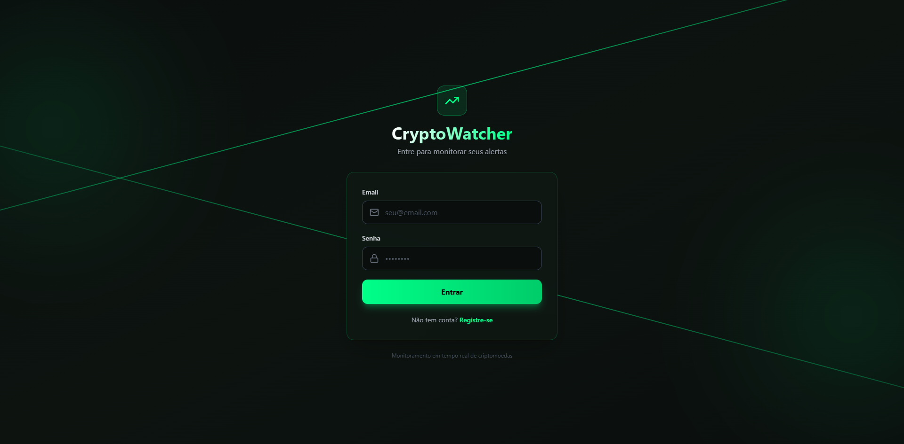
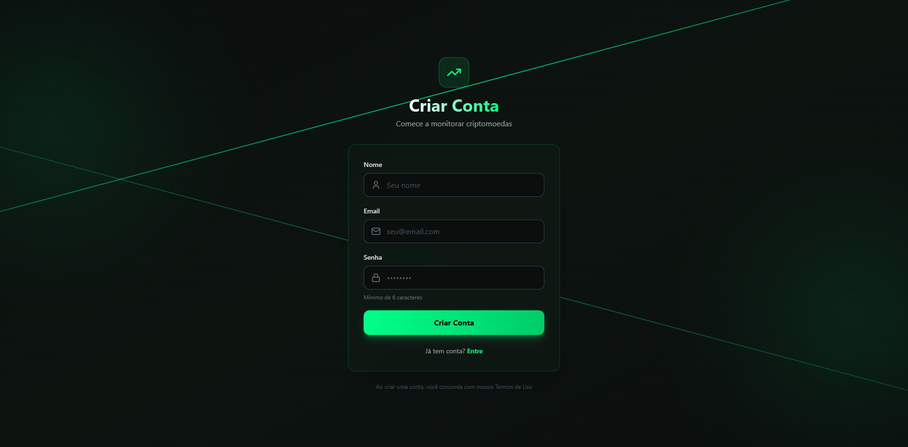
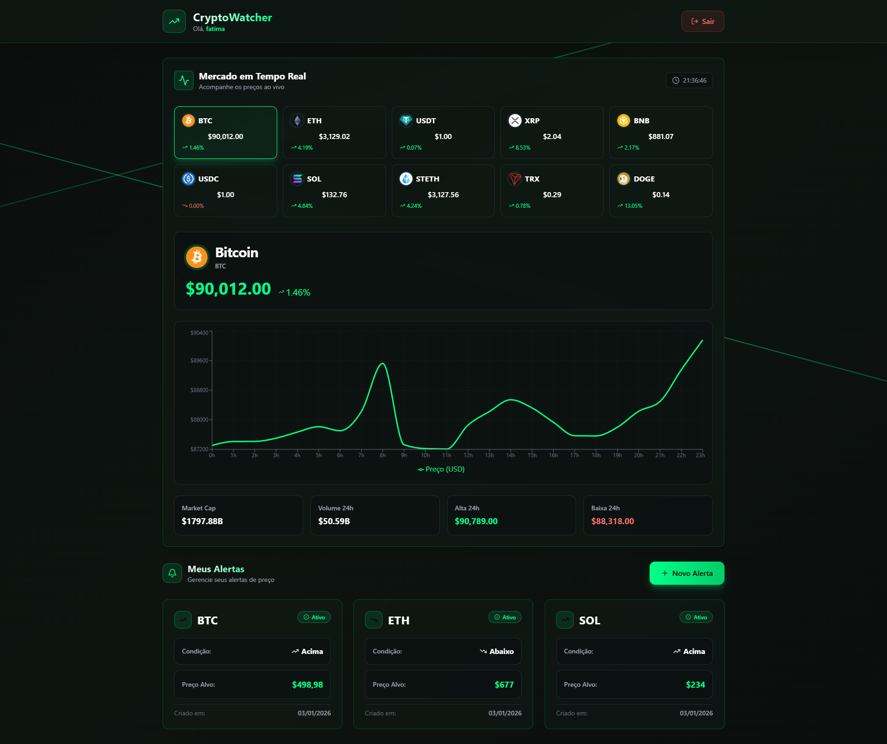

# 🚀 CryptoWatcher

Sistema enterprise de monitoramento de preços de criptomoedas com notificações em tempo real, desenvolvido com arquitetura limpa e práticas enterprise-grade.


## 📋 Sobre o Projeto

CryptoWatcher permite que usuários criem alertas personalizados para serem notificados quando o preço de uma criptomoeda atinge um valor específico. O sistema monitora preços em tempo real através da API do CoinGecko e processa notificações de forma assíncrona usando filas de mensagens.

## 📸 Screenshots

### Tela de Login

*Autenticação JWT com interface moderna e tema neon verde*

### Tela de Registro

*Sistema de cadastro com validação e feedback visual em tempo real*

### Dashboard Completo

*Dashboard integrado com gráficos em tempo real, top 10 criptomoedas e sistema de alertas personalizados*

## ✨ Funcionalidades

### Backend
- **Alertas Personalizados**: Configure alertas para serem disparados quando o preço estiver acima ou abaixo de um valor específico
- **Monitoramento Contínuo**: Worker service que verifica preços a cada minuto
- **Notificações por Email**: Templates HTML profissionais enviados via SendGrid
- **Autenticação JWT**: Sistema completo de registro, login e autorização
- **Cache Inteligente**: Redis para reduzir chamadas à API externa e melhorar performance
- **Resiliência**: Retry policies e circuit breakers com Polly para maior confiabilidade
- **API REST**: Interface completa com documentação Swagger
- **Testes Automatizados**: 47+ testes (Unit, Integration)

### Frontend
- **Dashboard Moderno**: Interface React com tema dark profissional
- **Gráficos em Tempo Real**: Visualização de preços com Recharts
- **Top 10 Criptomoedas**: Market cap, volume, variação 24h
- **Sistema de Login**: Autenticação completa com JWT
- **CRUD de Alertas**: Criar, visualizar e gerenciar seus alertas
- **Responsivo**: Design adaptável para mobile e desktop

## 🏗️ Arquitetura

### Clean Architecture
```
┌─────────────────────────────────────────────────────┐
│                    Presentation                     │
│         (API Controllers, Worker, React)            │
├─────────────────────────────────────────────────────┤
│                    Application                      │
│          (Use Cases, DTOs, Interfaces)              │
├─────────────────────────────────────────────────────┤
│                   Infrastructure                    │
│ (EF Core, Redis, RabbitMQ, SendGrid, External APIs) │
├─────────────────────────────────────────────────────┤
│                      Domain                         │
│           (Entities, Business Rules)                │
└─────────────────────────────────────────────────────┘
```

### Fluxo de Dados
```
┌──────────┐    ┌──────────┐    ┌──────────┐    ┌──────────┐
│   React  │──▶│   API     │──▶│ Database │──▶│ CoinGecko│
│Dashboard │    │  (JWT)   │    │ (SQL)    │    │   API    │
└──────────┘    └──────────┘    └──────────┘    └─────┬────┘
                                                      │
┌─────────────────────────────────────────────────────┼─────┐
│                    Worker Service                   │     │
│  ┌────────────┐    ┌─────────┐    ┌──────────────┐  │     │
│  │  Monitor   │──▶│  Redis   │──▶│   RabbitMQ   │◀┘     │
│  │  Prices    │    │ (Cache) │    │   (Queue)    │        │
│  └────────────┘    └─────────┘    └───────┬──────┘        │
│                                           │               │
│                    ┌──────────────────────▼────┐          │
│                    │  Email Consumer           │          │
│                    │  (SendGrid Templates)     │          │
│                    └───────────────────────────┘          │
└───────────────────────────────────────────────────────────┘
```

## 🛠️ Tecnologias Utilizadas

### Backend
- **.NET 9.0** - Framework principal
- **Entity Framework Core 9.0** - ORM para acesso a dados
- **ASP.NET Core Identity** - Sistema de autenticação
- **JWT Bearer** - Tokens de autenticação
- **Worker Services** - Background tasks

### Frontend
- **React 18** - Biblioteca UI
- **Vite** - Build tool moderno
- **Tailwind CSS 3** - Framework CSS
- **Recharts** - Biblioteca de gráficos
- **React Router DOM** - Navegação
- **Axios** - Cliente HTTP
- **Lucide React** - Ícones

### Infraestrutura
- **SQL Server 2022** - Banco de dados relacional
- **Redis 7** - Cache em memória
- **RabbitMQ 3** - Message broker
- **SendGrid** - Serviço de email
- **Docker & Docker Compose** - Containerização

### Bibliotecas
- **MassTransit 8.x** - Abstração para mensageria
- **Polly** - Resiliência (retry, circuit breaker)
- **BCrypt.Net** - Hash de senhas
- **StackExchange.Redis** - Cliente Redis
- **Swashbuckle (Swagger)** - Documentação da API
- **xUnit + FluentAssertions + Moq** - Testes

### Padrões e Práticas
- Clean Architecture
- SOLID Principles
- Repository Pattern
- Decorator Pattern (Cached Services)
- Domain-Driven Design (DDD)
- Dependency Injection
- JWT Authentication
- CORS Configuration

## 🚀 Como Executar

### Pré-requisitos
- [Docker](https://www.docker.com/get-started) e Docker Compose
- [.NET 9 SDK](https://dotnet.microsoft.com/download)
- [Node.js 18+](https://nodejs.org/)
- Conta SendGrid (para emails reais)

### Executar com Docker + Frontend Local

1. **Clone o repositório**
```bash
git clone https://github.com/fatimadachari/CryptoWatcher.git
cd CryptoWatcher
```

2. **Suba a infraestrutura**
```bash
docker-compose up -d
```

3. **Configure o SendGrid**

Edite `CryptoWatcher.API/appsettings.Development.json`:
```json
{
  "SendGrid": {
    "ApiKey": "SUA_API_KEY_SENDGRID",
    "FromEmail": "seu@email.com",
    "FromName": "CryptoWatcher"
  },
  "Jwt": {
    "SecretKey": "SuperSecretKeyComMaisde32CaracteresParaSegurancaMaxima!",
    "Issuer": "CryptoWatcher",
    "Audience": "CryptoWatcherAPI",
    "ExpirationMinutes": "1440"
  }
}
```

4. **Execute as migrations**
```bash
cd CryptoWatcher.API
dotnet ef database update --project ../CryptoWatcher.Infrastructure
```

5. **Rode a API**
```bash
dotnet run
# API rodando em: http://localhost:5065
```

6. **Rode o Worker** (outro terminal)
```bash
cd CryptoWatcher.Worker
dotnet run
```

7. **Rode o Frontend** (outro terminal)
```bash
cd CryptoWatcher.Web
npm install
npm run dev
# Frontend rodando em: http://localhost:5173
```

8. **Acesse a aplicação**
- Frontend: http://localhost:5173
- Swagger API: http://localhost:5065/swagger
- RabbitMQ Management: http://localhost:15672 (admin/admin123)

## 📚 Uso da API

### Autenticação

#### Registrar Novo Usuário
```bash
POST /api/auth/register
Content-Type: application/json

{
  "email": "user@example.com",
  "password": "senha123",
  "name": "João Silva"
}

# Response: { userId, email, name, token }
```

#### Login
```bash
POST /api/auth/login
Content-Type: application/json

{
  "email": "user@example.com",
  "password": "senha123"
}

# Response: { userId, email, name, token }
```

### Alertas (Requer Autenticação)

Adicione o token JWT no header:
```
Authorization: Bearer {seu-token-jwt}
```

#### Criar um Alerta
```bash
POST /api/alerts
Content-Type: application/json
Authorization: Bearer {token}

{
  "cryptoSymbol": "BTC",
  "targetPrice": 50000,
  "condition": 1
}
```

**Condições:**
- `1` = Above (acima do preço alvo)
- `2` = Below (abaixo do preço alvo)

#### Listar Alertas Ativos
```bash
GET /api/alerts/active
Authorization: Bearer {token}

# Retorna apenas os alertas do usuário logado
```

## 📁 Estrutura do Projeto
```
CryptoWatcher/
├── CryptoWatcher.Domain/              # Entidades e regras de negócio
│   ├── Entities/
│   ├── Enums/
│   └── Common/
├── CryptoWatcher.Application/         # Casos de uso e interfaces
│   ├── DTOs/
│   ├── Interfaces/
│   └── UseCases/
│       ├── Alerts/
│       ├── Auth/                      # NEW: JWT Authentication
│       └── Users/
├── CryptoWatcher.Infrastructure/      # Implementações técnicas
│   ├── Data/
│   ├── Repositories/
│   └── Services/
│       ├── JwtService.cs              # NEW: Geração de tokens
│       └── SendGridEmailService.cs    # NEW: Envio de emails
├── CryptoWatcher.API/                 # API REST
│   ├── Controllers/
│   │   ├── AlertsController.cs        # Protected endpoints
│   │   └── AuthController.cs          # NEW: Login/Register
│   └── Dockerfile
├── CryptoWatcher.Worker/              # Background Service
│   ├── Services/
│   ├── Consumers/
│   │   └── AlertTriggeredConsumer.cs  # Email sender
│   └── Dockerfile
├── CryptoWatcher.Web/                 # NEW: React Frontend
│   ├── src/
│   │   ├── components/
│   │   │   ├── LivePrices.jsx         # Gráficos tempo real
│   │   │   └── ProtectedRoute.jsx
│   │   ├── contexts/
│   │   │   └── AuthContext.jsx
│   │   ├── pages/
│   │   │   ├── Login.jsx
│   │   │   ├── Register.jsx
│   │   │   └── Dashboard.jsx
│   │   └── services/
│   │       ├── api.js
│   │       └── priceService.js
│   ├── package.json
│   └── vite.config.js
├── CryptoWatcher.Domain.Tests/        # Testes de Domínio (32 testes)
├── CryptoWatcher.Application.Tests/   # Testes de Application (7 testes)
├── CryptoWatcher.API.IntegrationTests/# Testes de Integração (8 testes)
└── docker-compose.yml
```

## 🧪 Testes
```bash
# Executar todos os testes
dotnet test

# Ver cobertura detalhada
dotnet test /p:CollectCoverage=true /p:CoverletOutputFormat=opencover

# Status atual: 47 testes passando ✅
```

**Cobertura de Testes:**
- ✅ 32 testes de Domain (Entities, ValueObjects)
- ✅ 7 testes de Application (Use Cases)
- ✅ 8 testes de Integration (Controllers, API)

## 🔒 Segurança

- ✅ **Senhas**: Hash com BCrypt (salted + work factor 11)
- ✅ **JWT**: Tokens assinados com HMAC-SHA256
- ✅ **CORS**: Configurado para permitir apenas origens autorizadas
- ✅ **Authorization**: Endpoints protegidos com `[Authorize]`
- ✅ **User Secrets**: Para desenvolvimento local
- ✅ **Environment Variables**: Para produção

⚠️ **IMPORTANTE**: Nunca commite API keys ou secrets no repositório!
```bash
# Use User Secrets localmente
dotnet user-secrets set "SendGrid:ApiKey" "sua-key-aqui"
dotnet user-secrets set "Jwt:SecretKey" "sua-secret-aqui"
```

## 📈 Roadmap

### ✅ Concluído
- [x] Clean Architecture com .NET 9
- [x] Monitoramento de preços (CoinGecko API)
- [x] Sistema de alertas com RabbitMQ
- [x] Cache Redis
- [x] Resiliência com Polly
- [x] Envio real de emails (SendGrid)
- [x] Autenticação JWT
- [x] Dashboard web com React
- [x] Gráficos em tempo real
- [x] Testes unitários e de integração
- [x] Docker Compose

### 🔜 Próximos Passos
- [ ] CI/CD com GitHub Actions
- [ ] Deploy em produção (Render.com + Vercel)
- [ ] Websockets para notificações real-time
- [ ] Histórico de alertas disparados
- [ ] Dashboard de estatísticas de usuário
- [ ] Suporte a múltiplas exchanges
- [ ] Webhooks customizáveis
- [ ] Testes E2E com Playwright
